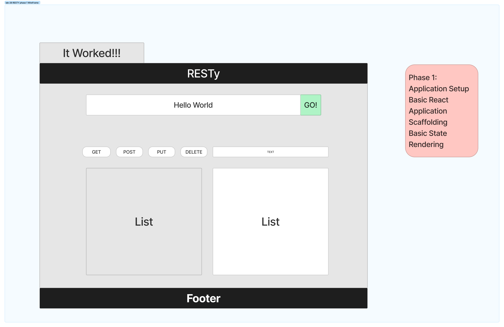

# RESTy

A browser based API testing tool

## Author: Brandon Pitts

## References and Credits

Referenced starter code and worked alongside Luis Rosales, Tyler Main, Stephen Clemmer, Stephanie Hill

## Business Requirements

Our application will be an API testing tool that can be run in any browser, allowing a user to easily interact with APIs in a familiar interface.

## How to use

npx create-react-app
npm start

## Phase 1 Requirements

Today, we begin the first of a 4-Phase build of the RESTy application, written in React. In this first phase, our goal is to setup the basic scaffolding of the application, with intent being to add more functionality to the system as we go. This initial build sets up the file structure so that we can progressively build this application in a scalable manner

## RESTy Phase-01

Refactored all of the child components of App.js from classes to functions. Use .scss pages to style the webpage and MUI

## Phase-02

In phase 2, we will be receiving user input in preparation of connecting to live APIs, using the useState() hook in our functional components. In order to properly manage state with the useState hook, we will now convert App.js to a functional component.

## Phase-03

In phase 3, we will be connecting RESTy to live APIs, fetching and displaying remote data. Our primary focus will be to service GET requests
The following user stories detail the major functionality for this phase of the project.
As a user, I want to enter the URL to an API and issue a GET request so that I can retrieve it’s data
As a user, I want to see the results returned from an API request in my browser in a readable format

### Wireframe

